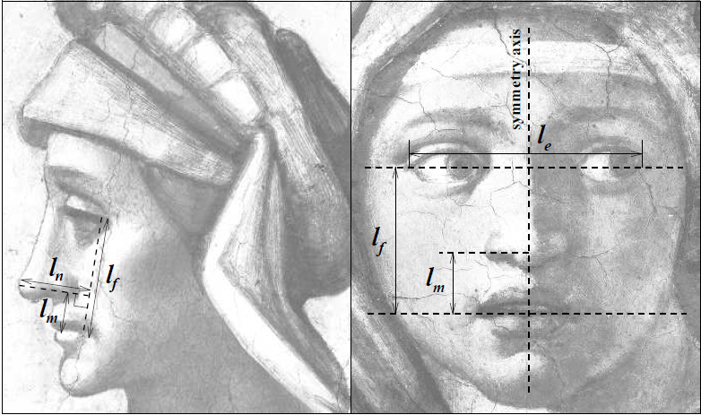
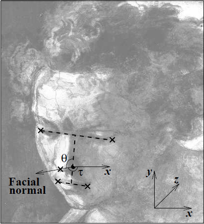
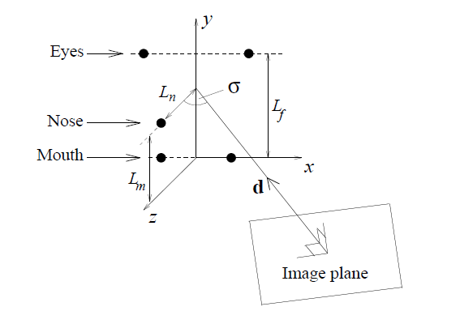
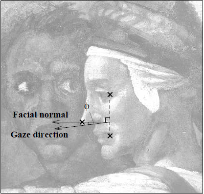

# Face Capture

[TOC]

人脸的姿势捕捉和模拟。实现了人脸识别以及人脸特征点的检测。根据人脸特征点的二维信息，还原出人脸姿势的旋转角。控制模型，让模型做出相同的姿势。

##  调用摄像头实时预览

在Android 5.0之前，可以直接在Manifest文件中获取到摄像头权限。但是在5.0之后，必须在运行时动态获取权限。同样在Android之后新增了一套API camera2，但是由于我们要兼容5.0以下的机器，所以我使用了API camera。

CameraPreview类继承SurfaceView，用来预览相机数据。首先获取设备支持的预览图片格式，大小等信息来初始化前置摄像头。利用setPreviewCallbackWithBuffer函数来来获取到预览的数据，在Callback函数中将YUVImage转换为Bitmap。使用带有Buffer的回调函数可以加快程序的运行速度，确保实时的预览。

由于Android camera API的设计，预览数据必须设置一个preview或texture。但是我希望将预览数据处理（人脸检测）后再显示，所有必须设置预览的texture然后将数据丢弃，我们自己渲染处理过后的预览数据。

更好的解决方案是从texture中获取数据，转换格式后进行处理，然后利用OpenGL ES渲染，这样比CPU操作速度快更多。（我并没有这样做。）

## 人脸识别及特征点检测

人脸识别及特征点检测采用dlib。Dlib是一个机器学习的C++库，包含了许多机器学习常用的算法，而且文档和例子都非常详细。我们这里使用它的人脸检测功能。dlib检测人脸并得到68个特征点（landmark）。


我们需要将dlib（C++库）移植到Android上，我使用了tzutalin编译好的[dlib-android](https://github.com/tzutalin/dlib-android-app)。作者将C++接口用Java包装好了，然后我们只需要调用Java即可。

## 人脸姿势估计

### 估计人脸法线方向

这一部分主要参考了论文Estimating Gaze from a Single View of a Face (Andrew Gee and Roberto Cipolla  University of Cambridge)。



如上图所示，我们定义$R_m \equiv L_m /  L_f$， $R_n \equiv L_n /  L_f$。我们建立一个坐标系，如下图（见图片的右下角）。



我们利用固定的比例$R_m$定位nose base点， nose base到nose tip的连线即为人脸法向。人脸法向的两个偏移角$\theta, \tau$如图所示。另外记$\sigma$为三维空间中optical axis和face normal之间的夹角。那么人脸的法线为：$$\hat{n} = [\sin \sigma \cos \tau, \sin \sigma \sin \tau, -\cos \sigma]$$
$\sigma$可以用以下方法估计:
$$R_n^2(1 - m_2) \cos^4 \sigma+ (m_1 - R_n^2 + 2m_2R_n^2) \cos^2 \sigma -- m_2R_n^2 = 0$$
其中，$m_1 \equiv {l_n / l_f}^2$, $m_2 \equiv \cos^2 \theta$。解上面方程即可得到$\sigma$， 再代入即可求解出$\hat{n}$。
整个过程中用到的变量大致都在下图中。



### 计算欧拉角



人脸凝视方向与人脸法相方向相差近似固定的夹角，约为15度。那么就可以计算出人脸凝视方向。正常情况下，人脸面朝前方，法线沿着z轴方向。通过两个法线可以计算出四元数。

四元数是简单的超复数。 复数是由实数加上虚数单位 i 组成，其中$i^2 = -1$。 相似地，四元数都是由实数加上三个虚数单位 $i,j,k$ 组成，而且它们有如下的关系：$ i^2 = j^2 = k^2 = -1$，$ i^0 = j^0 = k^0 = 1 $, 每个四元数都是 1、i、j 和 k 的线性组合，即是四元数一般可表示为$a + bk+ cj + di$，其中a、b、c 、d是实数。
对于i、j、k本身的几何意义可以理解为一种旋转，其中i旋转代表X轴与Y轴相交平面中X轴正向向Y轴正向的旋转，j旋转代表Z轴与X轴相交平面中Z轴正向向X轴正向的旋转，k旋转代表Y轴与Z轴相交平面中Y轴正向向Z轴正向的旋转。我们可以得到两个向量旋转所产生的四元数，再将其转换成欧拉角。

## 模型操作

我用了live2d模型来完成实验。Live2D是一种应用于电子游戏的绘图渲染技术，技术由日本Cybernoids公司开发。通过一系列的连续图像和人物建模来生成一种类似三维模型的二维图像，对于以动画风格为主的冒险游戏来说非常有用，缺点是Live 2D人物无法大幅度转身，开发商正设法让该技术可显示360度图像。Live2D Cubism 确实是名副其实的 2D，没有用到任何 3D 技术。其本质上是二维图片，所以对性能要求较低，非常适合Android设备使用。


我使用了Live2d 2.0 SDK for android.

```java
live2DModel.setParamFloat(L2DStandardID.PARAM_ANGLE_Z, (float) mActivity.emotion[0], 0.75f);
live2DModel.setParamFloat(L2DStandardID.PARAM_ANGLE_X, (float) mActivity.emotion[1], 0.75f);
live2DModel.setParamFloat(L2DStandardID.PARAM_ANGLE_Y, (float) mActivity.emotion[2], 0.75f);
```

同时增加了眨眼动作，使人物看起来更生动。同时做了帧与帧之间的平滑，进行了一定程度的防抖。

##  实验结果展示

我在小米5 Android 7.01 和 Nexus 10 Android 4.2上做的实验，均可以良好运行。


